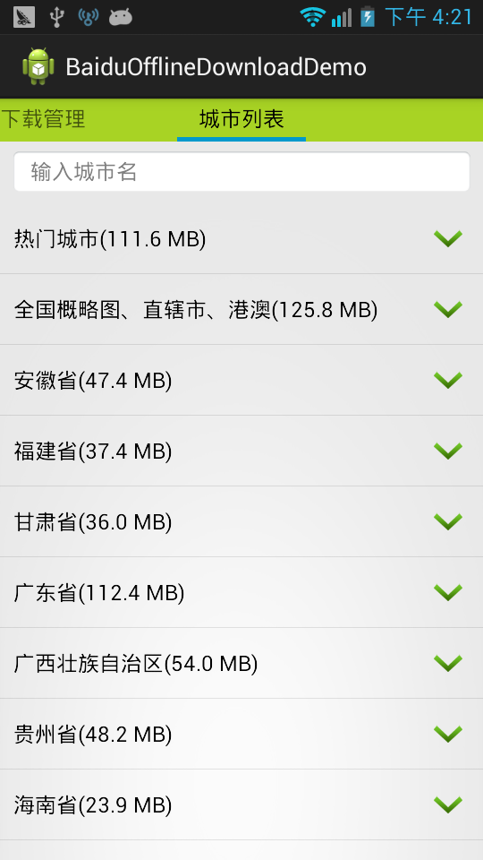
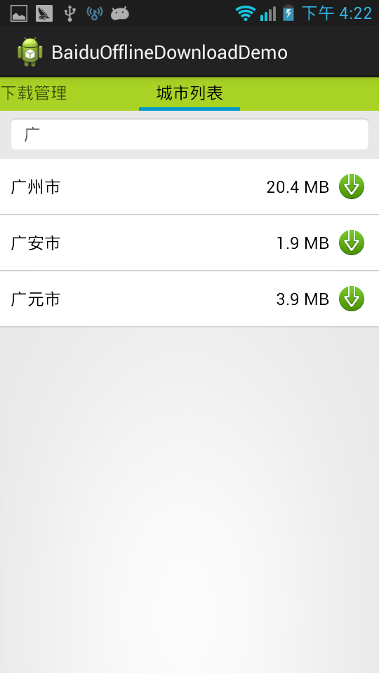
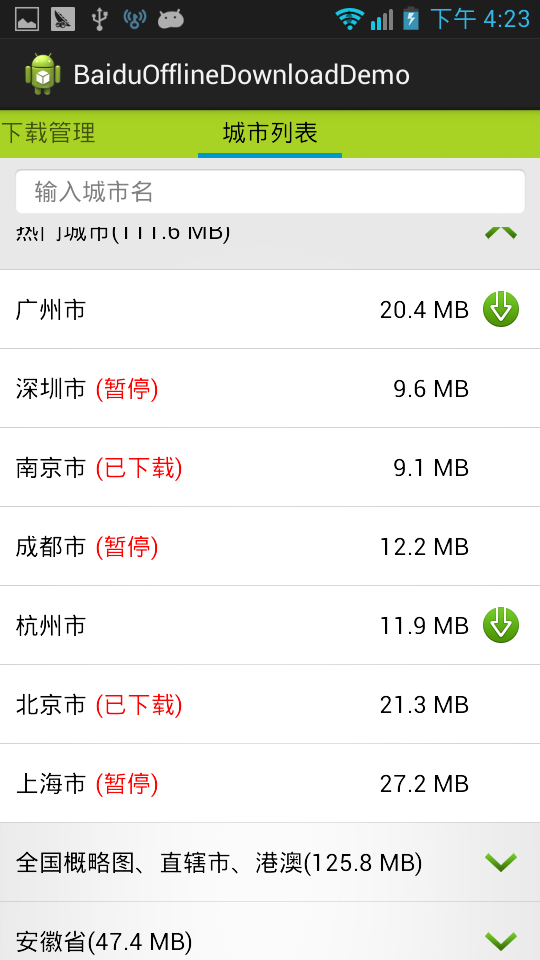
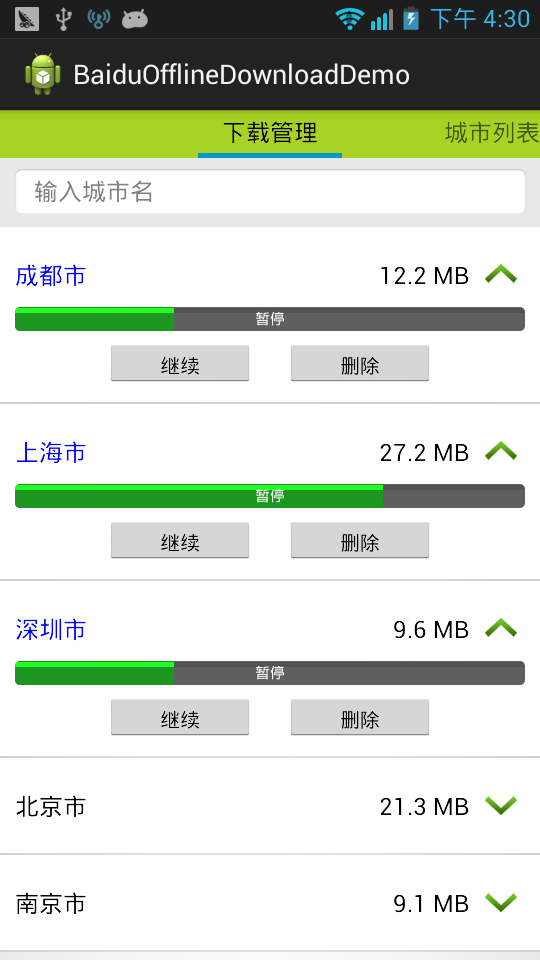

BaiduOfflineDownloadDemo
========================

## fork from: https://github.com/John-Chen/BaiduOfflineDownloadDemo

## This is Android Studio version

## v1.1.2
1. 升级gradle到3.1.0
1. 升级百度地图到4.5.2

百度矢量地图（基于V4.0.0版本sdk），离线地图下载管理的一个demo，因为官方给的离线地图的例子太简单，实际开发中没啥参考价值（还不如直接看api），这部分开发工作也有一定的工作量，所以把我最近公司做的离线地图部分的代码提取出来，做了个demo，给大家做个参考，做的不算太好，可能有bug，欢迎反馈。

吐槽下：百度离线地图，下载状态改变，例如暂停-->恢复居然没回调，要自己控制后记录状态改变。建议在MKOfflineMapListener里面添加下载中状态改变的回调。不过百度离线地图还是比高德要好用一点。

运行效果：

   
